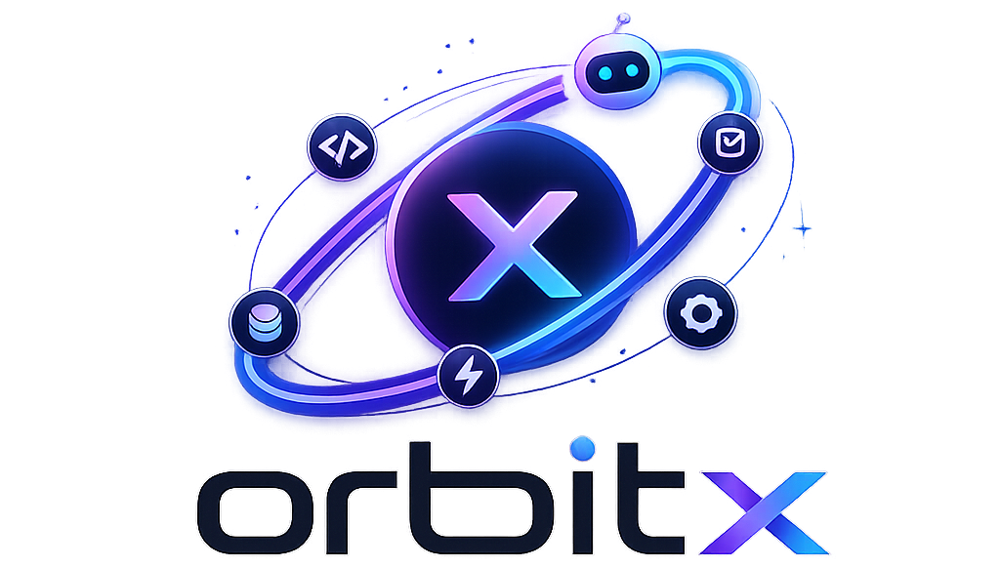

[](#)


Better DOCS Coming soon Sorry

Example of Simple Agent
```ts
const ollamaProvider = new OllamaProvider("gemma3:latest");

const agent = new SimpleAgent({
    aiProvider: ollamaProvider,
    instruction: "",
    tools: [GetCurrentTimeTool]
});

let oldRole: "assistant" | "tool" | undefined;
agent.run("what is current time?", (chunk) => {
    if (oldRole != chunk.role) {
        process.stdout.write(`\n${chunk.role}: `);
        oldRole = chunk.role;
    }
    process.stdout.write(chunk.content);
    if (chunk.done) {
        process.stdout.write("\n\n");
        oldRole = undefined;
    }
});
```

Example of Research Agent
```ts
const ollamaProvider = new OllamaProvider("gemma3:latest");

const agent = new ResearcherAgent({ aiProvider: ollamaProvider });

let oldRole: "assistant" | "tool" | undefined;
agent.run("what is IRR Value In USD", (chunk) => {
    if (oldRole != chunk.role) {
        process.stdout.write(`\n${chunk.role}: `);
        oldRole = chunk.role;
    }
    process.stdout.write(chunk.content);
    if (chunk.done) {
        process.stdout.write("\n\n");
        oldRole = undefined;
    }
});
```


Writing from base
```ts
const ollamaProvider = new OllamaProvider("gemma3:latest");

const connection = new MCPConnection();

const mcpServer = new MCPServer(connection);
mcpServer.registerTool(GetCurrentTimeTool);
const mcpClient = new MCPClient("DEFAULT_ENV", connection);

const agent = new BaseAgent({
    aiProvider: ollamaProvider,
    instruction: "",
    mcpClient,
    allowedTools: [GetCurrentTimeTool]
});

let oldRole: "assistant" | "tool" | undefined;
agent.run("what is current time?", (chunk) => {
    if (oldRole != chunk.role) {
        process.stdout.write(`\n${chunk.role}: `);
        oldRole = chunk.role;
    }
    process.stdout.write(chunk.content);
    if (chunk.done) {
        process.stdout.write("\n\n");
        oldRole = undefined;
    }
});
```